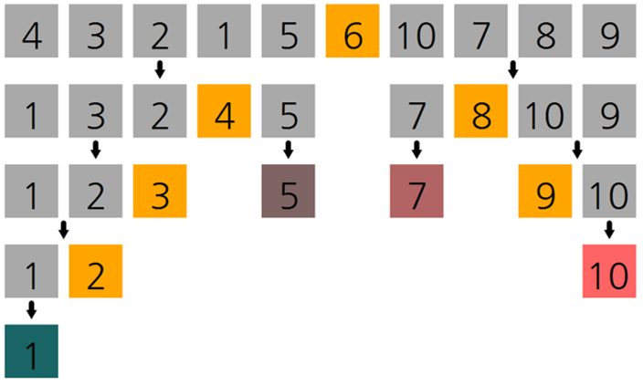
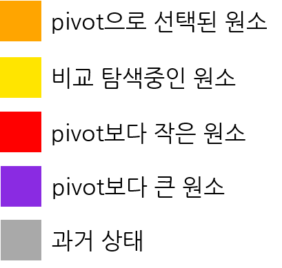

# Quick_sort_visualization
퀵 정렬(Quick sort) 알고리즘 시각화

**구현 영상**

[](http://www.youtube.com/watch?v=cKPC6uC_kGI)

## 0. 그대로 실행 시 주의사항
그대로 실행 시, 하위 디렉토리 ```\frames``` 를 생성하고 학습 내용에 대해 모두 저장하도록 되어 있습니다.
수많은 파일을 생성하고 싶지 않다면, ```Sort_visualization.cs``` 에서 ```Sort_visual```클래스의  ```save_frame()``` 함수를 수정하세요.

## 1. 퀵 정렬(Quick sort)
**퀵 정렬**

 퀵 정렬(Quick sort)은 정렬 알고리즘 중 하나로, 분할 정복(divide and conquer) 알고리즘으로 정렬을 수행한다. 주어진 배열에서 pivot을 선택하고 pivot보다 큰 값, 작은 값으로 나눈 뒤, 각 부분에 대해 동일한 과정을 재귀적으로 반복하여 전체가 정렬된 상태를 만드는 알고리즘.
 실질적인 데이터들에 대해 pivot을 효율적으로 선택하는 것이 가능하기 때문에 다른 O(N logN) 알고리즘보다 빠르게 동작한다.

**시간 복잡도**

최선의 경우 : 


최악의 경우 : 


**의사코드**


## 2. 시각화 방법
**배열 원소 탐색 시각화**

 간단한 재귀트리 형태로 표현



**배열 원소 수치 시각화**

 수치에 비례하게 원소의 색을 표현


**배열 원소 상태 시각화**


